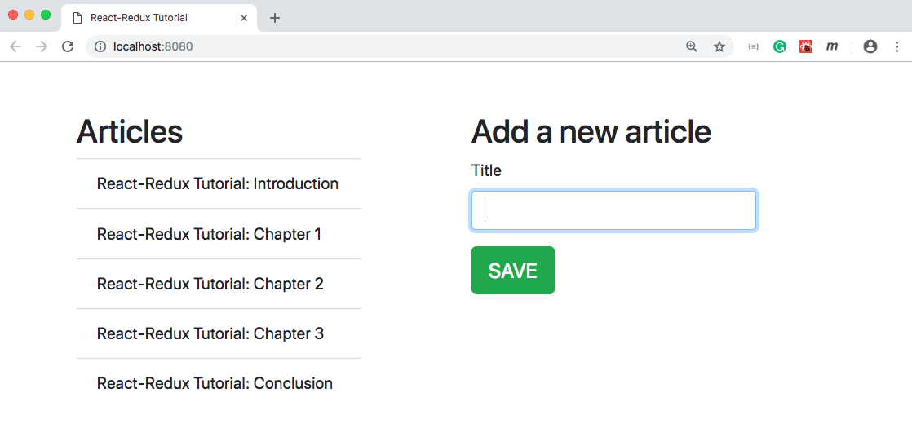

# React-Redux Quick Tutorial
> This is a simple and quick demonstration of React-Redux usage. You will be able to learn Redux concepts such as `store`, `reducer`, `action`, `dispatch`, `subscribe`, etc.
> The application is made of the following simple components:
> * App component - a container component
> * List component for displaying articles.
> * Form component for adding a new article

> Going through the above components will get you familiarized about how to connecting Redux with React components.
> You can see and learn how to connect a Redux store with a React app through the **`Provider`**, how to connect a part of the Redux state to the props of a React component by the **`mapStateToProps`** function, and how to connect Redux actions to React props by the **`mapDispatchToProps`** function.

## Installation

```bash
npm i && npm run start
```

## Screenshot

